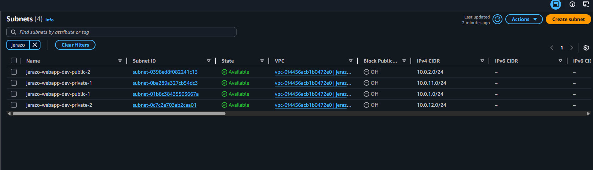
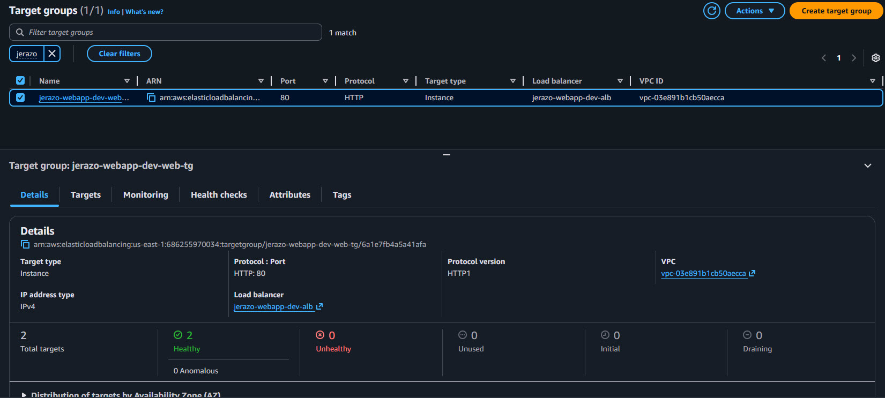
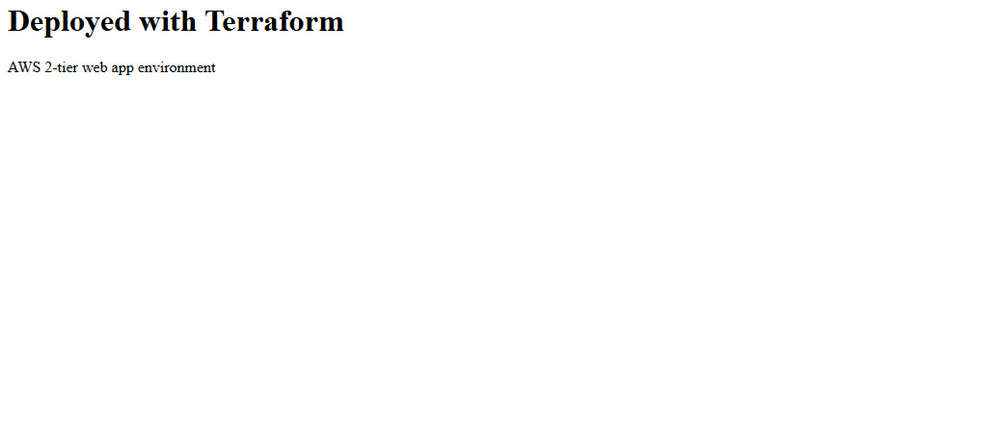
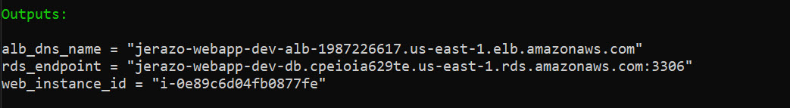

# 🚀 Terraform AWS Web App Infrastructure

Built a scalable, load-balanced AWS infrastructure using Terraform with Auto Scaling and Application Load Balancer.

This project provisions a production-style AWS 2-tier architecture using Terraform, including networking, compute, load balancing, and database layers.

It demonstrates Infrastructure as Code (IaC) best practices such as modular design, environment configuration, and secure network segmentation.

---

## 🧱 Architecture Overview

This project deploys:

- VPC with public and private subnets across multiple Availability Zones  
- Internet Gateway for public access  
- NAT Gateway for outbound internet access from private subnets  
- Application Load Balancer (ALB) for distributing incoming traffic  
- Auto Scaling Group (ASG) for scalable and self-healing compute  
- EC2 instances launched via Launch Template  
- RDS (MySQL/PostgreSQL) database in private subnets  
- Security Groups enforcing least-privilege access  
- Terraform remote state stored in S3

### Traffic Flow

```text
Internet
↓
[Application Load Balancer]
↓
[Target Group]
↓
[Auto Scaling Group]
↓
[EC2 Instances - Private Subnets]
↓
[RDS Database - Private Subnets]
```

---

## 🚀 Architecture Evolution

### Initial Version
- Single EC2 instance
- Basic VPC networking
- Direct access to application

### Enhanced Version
- Introduced Application Load Balancer
- Implemented Launch Template and Auto Scaling Group
- Enabled horizontal scaling and self-healing infrastructure
- Moved compute layer to private subnets behind ALB


## 📁 Project Structure

```text
.
├── main.tf
├── variables.tf
├── outputs.tf
├── provider.tf
├── versions.tf
├── backend.tf
├── terraform.tfvars
├── README.md
└── modules/
    ├── vpc/
    │   ├── main.tf
    │   ├── variables.tf
    │   └── outputs.tf
    ├── security_groups/
    │   ├── main.tf
    │   ├── variables.tf
    │   └── outputs.tf
    ├── ec2/
    │   ├── main.tf
    │   ├── variables.tf
    │   └── outputs.tf
    ├── alb/
    │   ├── main.tf
    │   ├── variables.tf
    │   └── outputs.tf
    └── rds/
        ├── main.tf
        ├── variables.tf
        └── outputs.tf
```

## Modules

- **vpc** → networking (subnets, IGW, NAT, route tables)  
- **security_groups** → access control rules  
- **ec2** → compute resources and user data  
- **alb** → load balancer and target groups  
- **rds** → database and subnet group
  
## 🔧 Configuration

Update terraform.tfvars with your values:

```hcl
aws_region   = "us-east-1"
project_name = "resume-webapp"
environment  = "dev"

instance_type = "t3.micro"

my_ip       = "YOUR_IP/32"
db_password = "StrongPassword123!"
```

## ▶️ Deployment

Initialize Terraform:

- terraform init

Preview changes:

- terraform plan

Deploy infrastructure:

- terraform apply

Destroy resources when finished:

- terraform destroy

## 📤 Outputs

After deployment, Terraform will output:

- ALB DNS Name → Access your web application
- VPC ID
- Subnet IDs
- Auto Scaling Group Name
- Launch Template ID

Use the ALB DNS Name in your browser to access the deployed web application.

## 🔐 Security Design
- ALB is publicly accessible and handles all inbound traffic  
- EC2 instances are deployed in private subnets (no direct internet access)  
- RDS database is isolated in private subnets  
- Security groups restrict traffic between tiers (ALB → EC2 → RDS)  
- SSH access is limited to trusted IP addresses only  

## 🧠 Key Concepts Demonstrated
- Terraform module design and reusable infrastructure  
- AWS networking (VPC, subnets, routing, NAT Gateway)  
- Load balancing with Application Load Balancer  
- Auto Scaling Groups for high availability and scalability  
- Infrastructure separation (public vs private tiers)  
- Launch Templates for standardized EC2 provisioning  
- Remote state management using S3
- Secure architecture using least-privilege principles 

## 📸 Screenshots


### AWS VPC dashboard


### ALB showing healthy targets


### Browser hitting ALB DNS


### Terraform apply output


---

## 💼 Project Summary

Built a modular Terraform project to provision a production-style AWS infrastructure including VPC, subnets, security groups, EC2, Application Load Balancer, and RDS. Implemented environment-based configuration, secure network segmentation, and reusable infrastructure components.

### 🧩 Lessons Learned
- How Terraform handles resource dependencies automatically
- Importance of separating infrastructure into modules
- Networking design for secure cloud environments
- Managing state and avoiding configuration drift

### ⚠️ Notes
- This project is for learning/demo purposes
- Costs may be incurred (NAT Gateway and RDS especially)
- Always run terraform destroy after testing

### ⭐ Why This Project Matters

This project demonstrates real-world Terraform skills including:

- modular architecture
- secure cloud design
- infrastructure lifecycle management